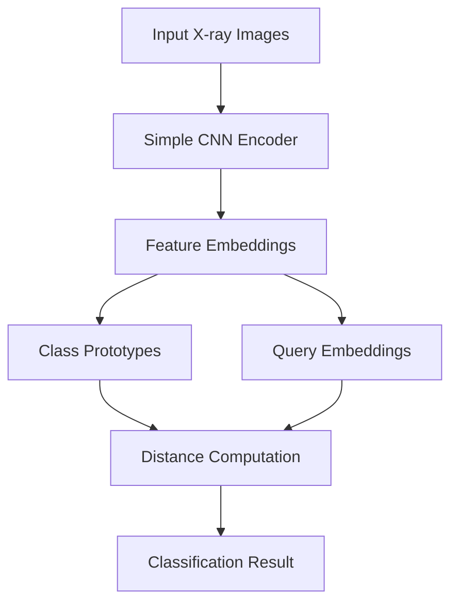

# 🫁 Few-Shot Lung Disease Classification via Prototypical Networks

<div align="center">
  
[](https://pytorch.org/)
[](https://python.org/)
[](README.md)

*Advanced few-shot learning approach for medical image classification using state-of-the-art Prototypical Networks*

[NIT Trichy, Summer Internship Work](https://drive.google.com/file/d/1e6tpFw6hi4PxetJ8ATY8n1p4mnAubt5g/view?usp=drive_link) 

[📖 Blog Post](https://meta-learning.hashnode.dev/cracking-the-code-of-rare-cases-meta-learning-in-medical-imaging) • [🚀 Quick Start](#-quick-start) • [📊 Results](#-results) • [🔬 Methodology](#-methodology)

</div>

---

## 🌟 Overview

This repository implements a **cutting-edge few-shot learning solution** for chest X-ray classification using Prototypical Networks. Our model excels in scenarios with limited labeled medical data, achieving **81.6% accuracy** across five critical lung conditions.

### 🎯 Key Features

- 🧠 **Few-shot learning** with episodic training
- 🏥 **Multi-class medical classification** (5 diseases)
- 📈 **High accuracy** with limited training data
- ⚡ **Efficient CNN encoder** architecture
- 🔄 **Automated model checkpointing**

---

## 🏥 Disease Classifications

Our model accurately distinguishes between these five critical lung conditions:

| Class | Description | Clinical Importance |
|-------|-------------|-------------------|
| 🫁 **Normal** | Healthy lung tissue | Baseline comparison |
| 🦠 **Bacterial Pneumonia** | Bacterial lung infection | Requires antibiotic treatment |
| 🧬 **Viral Pneumonia** | Viral lung infection | Different treatment protocol |
| 🌐 **COVID-19** | SARS-CoV-2 infection | Critical for pandemic response |
| 🫁 **Tuberculosis** | Mycobacterial infection | Global health priority |

---

## 🔬 Methodology

### 🧠 Prototypical Networks Architecture



### 🏗️ Model Architecture

- **Encoder**: Simple CNN with 3 Conv2D layers
- **Features**: ReLU activation + MaxPooling
- **Pooling**: Adaptive Average Pooling
- **Classification**: Euclidean distance to prototypes

### 📊 Training Configuration

| Parameter | Value | Description |
|-----------|-------|-------------|
| **Episodes per Epoch** | 500 | Episodic training instances |
| **Total Epochs** | 20 | Complete training cycles |
| **Optimizer** | Adam | Adaptive learning algorithm |
| **Learning Rate** | 1e-3 | Gradient descent step size |
| **Loss Function** | CrossEntropy | Classification loss |
| **Training Time** | 8-10 min/epoch | Computational efficiency |

---

## 🚀 Quick Start

### 1️⃣ Clone Repository
```bash
git clone https://github.com/shiga2006/Multi-class-lung-disease-classification
cd Multi-class-lung-disease-classification
```

### 2️⃣ Setup Environment
```bash
# Install dependencies
pip install -r requirements.txt

# Verify PyTorch installation
python -c "import torch; print(f'PyTorch version: {torch.__version__}')"
```

### 3️⃣ Prepare Dataset
Organize your chest X-ray images in the following structure:

```
Lung Disease Dataset/
├── 📁 train/
│   ├── 🫁 Normal/
│   ├── 🦠 Bacterial Pneumonia/
│   ├── 🧬 Viral Pneumonia/
│   ├── 🌐 COVID/
│   └── 🫁 Tuberculosis/
└── 📁 val/
    ├── 🫁 Normal/
    └── ... (same structure)
```

### 4️⃣ Start Training
```bash
# Edit DATA_DIR in main.py if needed
python main.py
```

### 5️⃣ Monitor Progress
- 📈 Training curves saved automatically
- 🎯 Best model: `best_protonet_xray_long[5class].pth`
- 📊 Confusion matrices generated

---

## 📊 Results

### 🎯 Performance Metrics

<div align="center">

### Overall Accuracy: **81.6%**


</div>

### 📈 Training Progress

Our model demonstrates excellent convergence with minimal overfitting:


### 🎭 Confusion Matrix Analysis

The confusion matrix reveals strong diagnostic capabilities across all disease categories:


---

## 💻 System Requirements

### 🖥️ Hardware Specifications
- **Processor**: 13th Gen Intel® Core™ i5-13500 (recommended)
- **Architecture**: 64-bit x64-based system
- **OS**: Windows (tested), Linux compatible
- **Memory**: 8GB RAM minimum, 16GB recommended

### 📚 Software Dependencies
- **Python**: 3.8+
- **PyTorch**: Latest stable version
- **Additional**: See `requirements.txt`

---

## 🔬 Technical Deep Dive

### 🧠 Few-Shot Learning Approach

Our implementation leverages **episodic training** where:
- Each episode samples `N_WAY` classes
- `N_SUPPORT` images per class form prototypes
- `N_QUERY` images test classification accuracy
- Distance-based classification using Euclidean metrics

### 🏗️ CNN Encoder Details

```python
# Simplified architecture overview
Conv2D(64) → ReLU → MaxPool →
Conv2D(128) → ReLU → MaxPool →
Conv2D(256) → ReLU → MaxPool →
AdaptiveAvgPool2d → Flatten → Linear
```

---

## 📚 Learn More

### 📖 Additional Resources
- [📝 Detailed Blog Post](https://meta-learning.hashnode.dev/cracking-the-code-of-rare-cases-meta-learning-in-medical-imaging)
- [🔬 Prototypical Networks Paper](https://arxiv.org/abs/1703.05175)
- [🏥 Medical Imaging Applications](https://example.com)

### 🤝 Contributing
We welcome contributions! Please see our contribution guidelines for:
- 🐛 Bug reports
- 🚀 Feature requests
- 📚 Documentation improvements
- 🧪 Additional experiments

---

## 📄 License & Citation

This project is intended for **academic and research purposes only**.

```bibtex
@misc{lung_disease_classification_2024,
  title={Few-Shot Lung Disease Classification via Prototypical Networks},
  author={Shivashiga A.M},
  year={2025},
  url={https://github.com/shiga2006/Multi-class-lung-disease-classification}
}
```

---

<div align="center">

### 🌟 Star this repository if you find it helpful!

[](https://github.com/shiga2006/Multi-class-lung-disease-classification)

**Made with ❤️ for the medical AI community**

</div>
